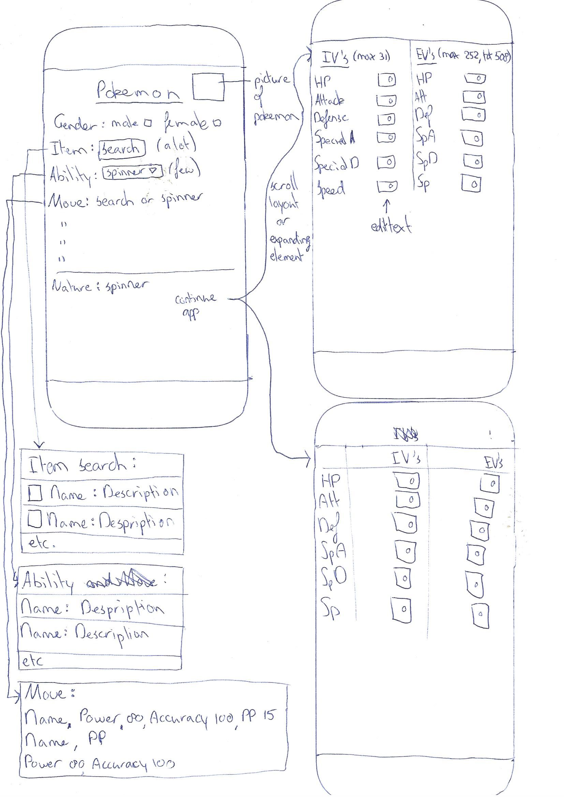
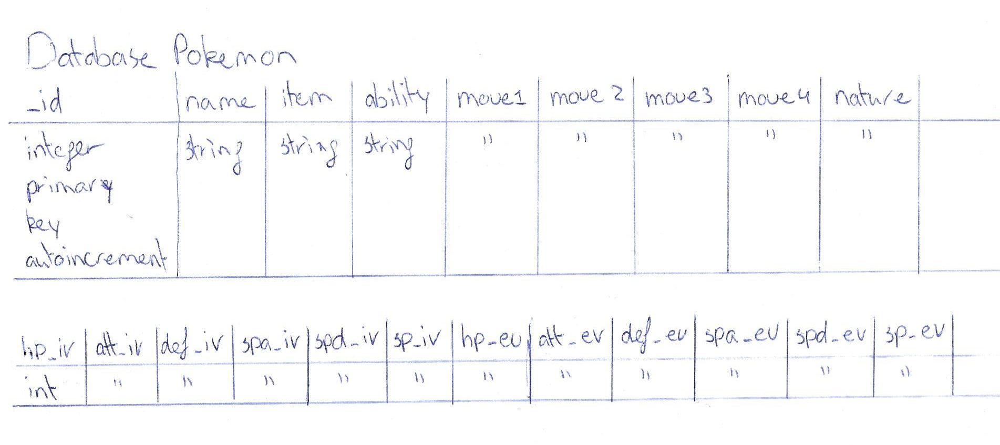

## Week 1
### Day 1 - Monday
I already have code that I can run. I've already processed two API requests and processed them. The first one is for getting all the pokemon names, and the second one is for getting all the information for a single pokemon. The names are used for a search popup so that you can select a Pokemon to add. This name is then used in the information API request. The response from this request is already handled by GSON so that it's put inside a Pokemon model.
- Contemplating using either ScrollView or ExpandableView for the AddActivity, since it needs a lot of information. Need to get a design for how I was to show this before I can tell which one would be better

### Day 2 - Tuesday
- Realised I still need to send a request to the API for the moves, because I want to show the power and accuracy of a move, something which is not included in the information given bij the Pokemon information. Note: The moves a Pokemon can learn are specific to each pokemon.
- Realised I still need to send a request to the API for the items and berries, because I want to show the effects of the items that can be equipped. Note: This information cannot be obtained through Pokemon informatinon because each item/berry can be used on any pokemon.

### Day 3 - Wednesday
- Might have to use the search popup for selecting moves too. I think it had options to show more than just names.
- Will need API request for move info
- Will need API request for berry names, which I need to use for API request for item information
- In API response for items: attributes 0: name needs to be "holdable-active", url needs to be "https://pokeapi.co/api/v2/item-attribute/7/"
- Need to use Fragments for a better looking layout

### Day 4 - Thursday
- (Begin of the day) Fragments suck
- Both Renske and Natashja had trouble giving advice on fragments. Decided with Natashja's help to move both the requests into the Fragment itself (without callback).
- (End of the day) Both requests now work inside the fragment itself without callback and the app doesn't crash anymore :)

### Day 5 - Friday
- Decided to stop using fragments and TabLayout (now for atleast), as it took too much time to get it working properly. But I will keep using that idea for navigation
- Added navigation buttons to normal activities (replacement for TabLayout). Height will be 50dp, as that was about the height the TabLayout had and looks good
- Added ListView and ListView adapter to Pokedex. It now shows all pokemon names.
- Made the overall layout better looking. Like white text for tabs, no transition animations when changing activities and some margins for text so that it's more readable.

### Weekend - Saturday and sunday
- Added all needed information to SearchActivity in an ok looking layout
- Built the SQLite database for saving pokemon and added 1 example
- Completed the insert method for the database (22 items per pokemon)
- Created a SavedPokemon class to hold the data of the saved pokemon
- Made a ListAdapter class to show saved pokemon for the database in the ListActivity
 

## Week 2
### Day 6 - Monday
- Decided to use input type phone for edittexts in SearchActivity. This only shows numbers for input and lets you automatically go to the next edittext
- Changed SearchActivity to AddActivity since that better reflects it's purpose
- Database for saved pokemon now works
- ListDetailActivity for showing saved pokemon now works
- Changed PokemonRequest and DataRequest to PokemonNamesRequest and PokemonDataRequest respectively
- Added an ItemRequest and a NatureRequest to get names to put in AddActivity
- Alpha is basically finished
- I need a way to display (and save) descriptions for items, natures and moves

### Day 7 - Tuesday
- Made class models for Move, Item and Nature, to save the description from api requests
- Made ItemDataRequest to request more information for individual items
- ItemDataRequest is super slow. Need to find another way to implement it instead of looping through the entire list of items and getting info for them
- Made a separate folder for all the request files
- Added new columns "url_shiny" and "gender" to database
- Added reset buttons for IV's and EV's

### Day 8 - Wednesday
- Load item and move data only once with API and save it in a database. This way the loading times should only be slow the very first time app is launched after installing (TO DO)
- Tried looping over nature names and make request for nature data, which didn't work very well. So I will use a database for natures too

### Day 9 - Thursday
- Made all the classes and requests to put all the data in databases

### Day 10 - Friday
- Loading into databases works, but doing all the requests at once isn't a good idea. Each request will get a seperate button. The moves data will get multiple buttons because of the huge ammount of needed api requests (950+)

### Weekend - Saturday and sunday
- Each pokemon only has 2 or 3 abilities, so I won't use a database, but just 2 or 3 api requests
- Built necessary files for ability data requests
- Ability spinner now shows both the name and the effect of the abilities
- Using a spinner for items and moves is terrible because there are too many options. You need to be able to search. So I will use a custom AutoCompleteTextView for these

## Week 3 (last week)
### Day 11 - Monday
- AutoCompleteTextView finally works for items
- Still need to do the AutoCompleteTextView for moves
- I want some sort of progressbar for the loading of data into the database. Right now you have no feedback on how much is already done
- Still need to do better layout for Pokedex Details
- Still need to do better layout for list of saved pokemon
- Still need search or sort function for Pokedex/Search pokemon/List of saved Pokemon
- Still need button to add pokemon from pokedex
- Still need button to go to pokedex from saved pokemon
