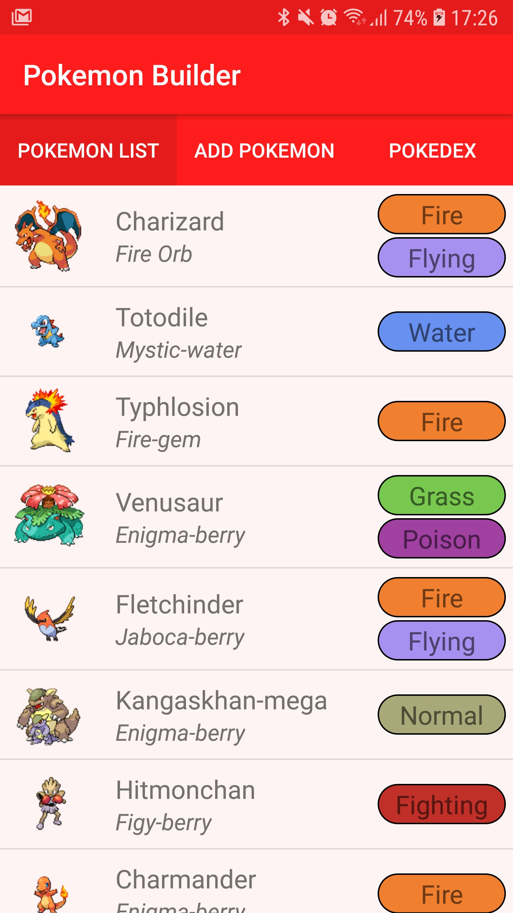
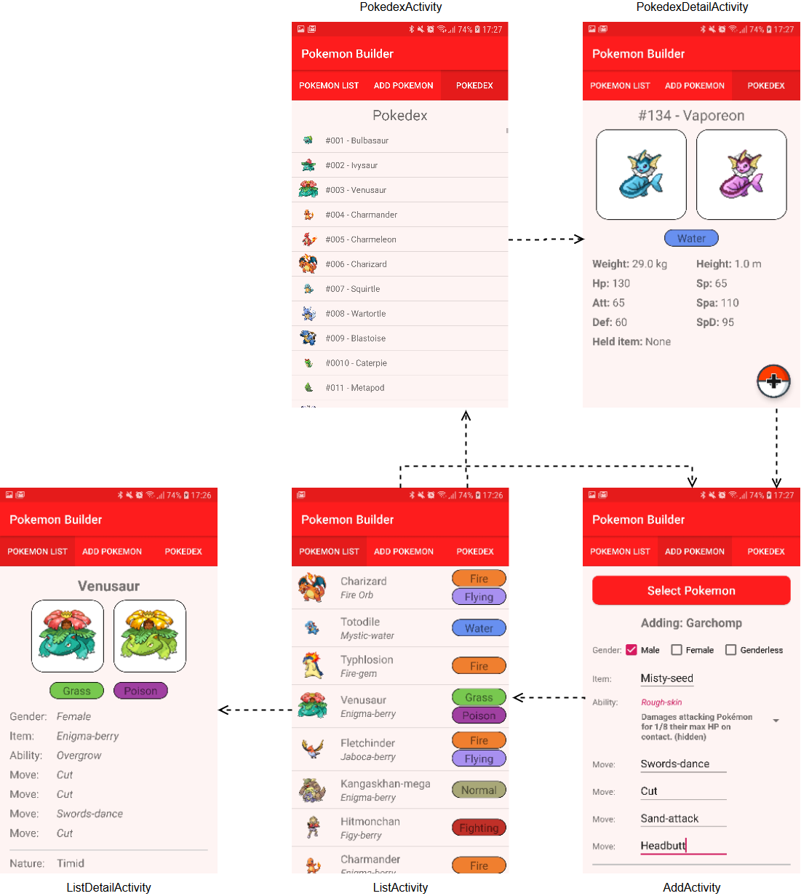

## Rapport van de Pokemon-Builder app

### Beschrijving
In this app you can save the custom 'built' pokemon that you have made inside the actual games. This makes it easier to remember and acces all the different pokemon and builds that you have.
In deze app kun je de zelfgemaakt pokemon opslaan die je in de echte games hebt gemaakt. Dit maakt het makkelijker om te onthouden welke pokemon je al gemaakt heb, en in welke configuratie je dit gedaan hebt.

### Technisch Ontwerp
In alle activities zitten bovenin tabbladen om door de app heen te kunnen navigeren. Met een iets donkerdere kleur wordt aangegeven op welke tabblad je momenteel zit.

#### ListActivity
Het eerste scherm waar je komt als je de app start is de ListActivity (bovenstaande afbeelding). Als het de eerste keer is dat de app geopend wordt dan zullen er bovenaan 7 knoppen staan om data in te laden in verschillende databases, namelijk voor: items, natures, en de moves opgedeeld in 5 stukken. Hiervoor is gekozen omdat je bij de api eerst de namen op moet halen, om daarna pas de individuele data op te kunnen halen. In dit geval gaat dat om ongeveer 1300+ api requests, en als dat in één keer werd gedaan dan crashte de app. Nu het in meerdere delen gedaan word, en er even kan worden gewacht tussen de requests, is het wel mogelijk om alles in te laden. Er zijn dus losse databases voor items, natures en moves. Een extra voordeel hiervan is dat het ophalen van data uit de database een stuk sneller is dan het opvragen bij de api. Dus na het initiële lange wachten om het in te laden is het opvragen vrij snel als dat nodig is.

Naast het inladen van deze databases word er ook een PokemonNamesRequest uitgevoerd en opgeslagen in een arraylist. Deze arraylist word de gehele app doorgegeven met intents zodat je niet elke keer opnieuw deze request uit hoeft te voeren.

De main functie van ListActivity is het ophalen van opgeslagen pokemon uit de database en deze via een adapter weer te geven in een ListView. Per pokemon kun je de volgende eigenschappen zien: Plaatje, naam, meegegeven item en het/de type(s) van de pokemon. Hier is voor gekozen om de opgeslagen pokemon te kunnen differentiëren. Vervolgens kun je op één van de weergegeven pokemon klikken om de details te zien, een pokemon ingedrukt houden om hem te verwijderen, of via de tabbladen bovenin een pokemon toevoegen of naar de pokedex gaan.

#### ListDetailActivity
In ListDetailActivity kun je alle ingevulde informatie zien van je opgeslagen pokemon. Je informatie van de geselecteerde pokemon wordt uit de database gehaald en omgezet naar de class SavedPokemon. Vervolgens wordt de data uit de SavedPokemon class gebruikt om alle views van de activity in te vullen zodat je alle info kunt zien. Als een pokemon geen shiny plaatje heeft wordt het normale plaatje gecentreerd zodat de layout mooi blijft.

#### AddActivity
AddActivity is waar nieuwe pokemon worden toegevoegd aan de database. Voordat je een pokemon kan toevoegen worden er eerst meerdere controles gedaan om te zien of alle velden wel zijn ingevuld.

Het begint door bovenaan op de knop te drukken om een pokemon te selecteren. Dit opent een popup waarin je kan zoeken naar een pokemon met een autocomplete functie. Zodra je een pokemon hebt geselecteerd gebeuren er meerdere dingen: Er wordt een request naar de api gemaakt voor alle data van de geselecteerde pokemon en alle items/moves/natures worden uit de database gehaald. Bij de moves wordt eerst gekeken welke moves de pokemon kan leren, en deze worden dan één voor een uit de database gehaald. Vervolgens worden de natures op een spinner gezet, de items/moves via adapters op meerdere AutoCompleteTextViews gezet, en de via de request verkregen abilities worden via een adapter op een spinner gezet. Bij al deze opties staat zowel de naam als beschrijving, zodat je kan zien wat het doet of wat voor effect het heeft.

Daaronder zijn een aantal EditTextViews waar nummers ingevuld moeten worden voor boosts die je aan je pokemon in specifieke stats wil geven. Dit mag ook 0 zijn, zolang je maar iets invuld.

Als je uiteindelijk klaar bent klik je op knop onderaan om de pokemon aan de database toe te voegen en word je weer naar de ListActivity gestuurd waar je nieuwe pokemon nu in staat.

#### PokedexActivity
In de PokedexActivity wordt de eerdergenoemde arraylist van alle pokemon namen gebruikt in combinatie met een adapter om een ListView te vullen met een plaatje, de id en de naam van de pokemon. In deze ListView staan dus alle bestaande pokemon (940+).
Je kunt door deze lijst heen scrollen om een interesante pokemon uit te zoeken, als je er één hebt gevonden kun je hem aanklikken. Dit zal je naar de detail pagina sturen van deze pokemon.

#### PokedexDetailActivity
De PokedexDetailActivity is waar je extra informatie kunt vinden van de pokemon die je in PokedexActivity hebt geselecteerd. De naam van de geselecteerde pokemon wordt gebruikt om een api request voor data van deze pokemon te maken. Dit wordt omgezet in een Pokemon object waar alle data inzit, om vervolgens de data er uit de halen die weergegeven wordt op de pagina.

Dit is bedoeld om wat extra's over de pokemon te weten te komen, en het kan ook handig zijn voor het uitzoeken van een nieuwe. Het gewicht en de statistieken die te zien zijn, zijn namelijk erg belangrijk bij het kiezen van een nieuwe pokemon. Als je een goede pokemon gevonden hebt kun je rechts onderin op de pokeball klikken om naar de AddActivity te gaan en de pokemon aan de database toe te voegen.

In de afbeelding hieronder is een overzicht van alle schermen en waar ze heen leiden in de navigatie.

